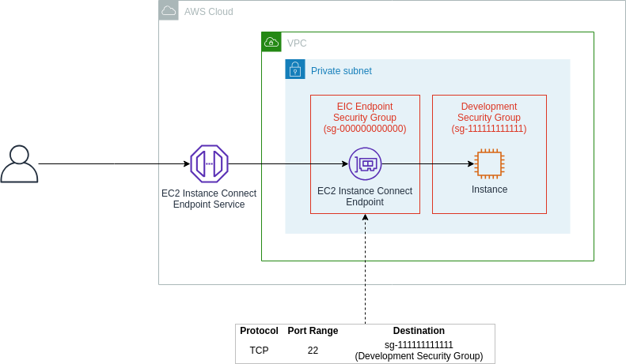

# Project
A project focusing on implementing and exploring EC2 Instance Connect endpoint for easy and secure SSH to EC2 instances.

# EC2 Instance Connect Endpoint

A new AWS feature that allows you to connect securely to your instances and other VPC resources from the Internet. With EIC Endpoint, you no longer need an IGW in your VPC, a public IP address on your resource, a bastion host, or any agent to connect to your resources.

# DIAGRAM

# Prerequisites
To create an EC2 Instance Connect Endpoint, users require permissions for the following actions:
- ec2:CreateInstanceConnectEndpoint
- ec2:CreateNetworkInterface
- ec2:CreateTags
- iam:CreateServiceLinkedRole

To describe and delete EC2 Instance Connect Endpoints, users require permissions for the following actions:
- ec2:DescribeInstanceConnectEndpoints
- ec2:DeleteInstanceConnectEndpoint